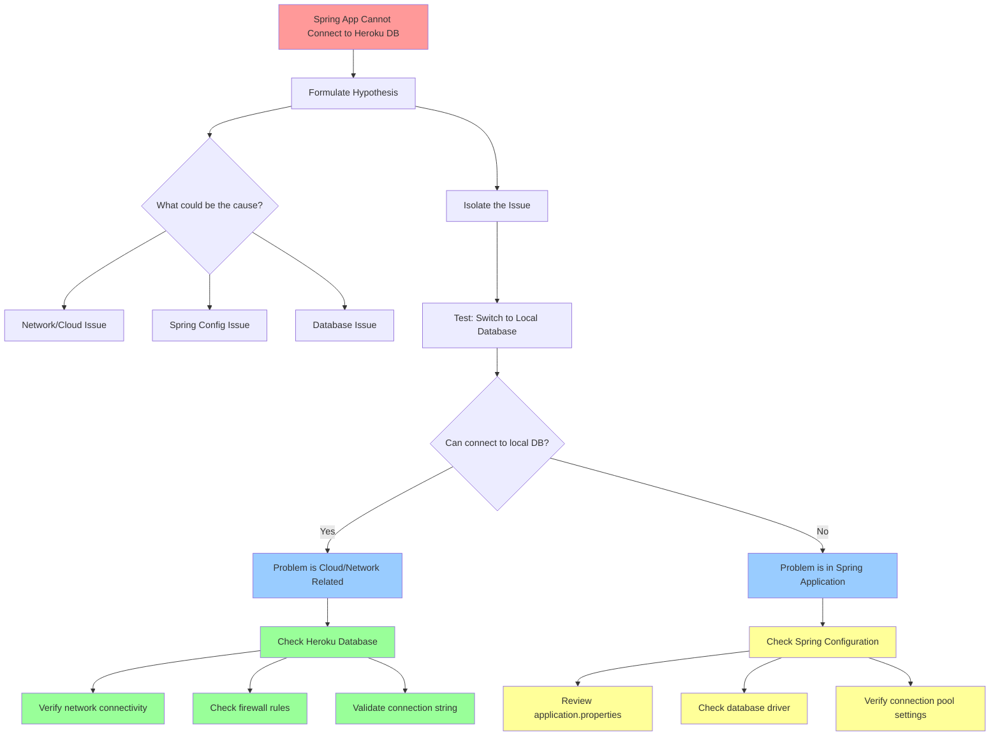

# Module 4 DevOps Coaching - Comprehensive Feedback

## Table of Contents
1. [Testing and CI/CD Best Practices](#1-testing-and-cicd-best-practices)
2. [Debugging and Troubleshooting Techniques](#2-debugging-and-troubleshooting-techniques)
3. [Development and Version Control Best Practices](#3-development-and-version-control-best-practices)
4. [Productivity and Learning Enhancement](#4-productivity-and-learning-enhancement)
5. [Deployment and Infrastructure Understanding](#5-deployment-and-infrastructure-understanding)
6. [Career Development and Employability](#6-career-development-and-employability)

---

## 1. Testing and CI/CD Best Practices

### 1.1 Local Testing with CI/CD

**Key Practice**:
- One tips for fast debugging: Test your pipeline locally using the same scripts as your CI/CD system.
   - Example: Install `heroku` in your local machine and run the exact command to see where is the root cause
- Perform unit tests on code locally and fix issues before committing
- Run tests locally first to get immediate feedback

**Benefits**:
- Reduces pipeline failures due to simple syntax errors or missing dependencies
- Saves time and resources by catching issues early

**Useful Resources**:
- [16 CI/CD Best Practices for 2025 - LambdaTest](https://www.lambdatest.com/blog/best-practices-of-ci-cd-pipelines-for-speed-test-automation/)
- [AWS CI/CD Best Practices Guide](https://docs.aws.amazon.com/prescriptive-guidance/latest/strategy-cicd-litmus/cicd-best-practices.html)

### 1.2 Spring Test Containers for Enhanced Testing

**Modern Approach**: Use Spring TestContainers to facilitate realistic integration testing
- Spin up lightweight, disposable containers for databases and services
- Test with real dependencies instead of mocks
- Spring Boot 3.1+ provides enhanced TestContainers support with `@ServiceConnection`

**Implementation Benefits**:
- Isolated test environments that closely mimic production
- Support for PostgreSQL, MongoDB, Redis, Kafka, RabbitMQ, and more
- Automated container lifecycle management

**Example Use Cases**:
- Database integration tests with real PostgreSQL/MySQL instances
- Message queue testing with actual RabbitMQ/Kafka containers
- Cache testing with Redis containers

**Learn More**:
- [Spring Boot TestContainers Official Guide](https://docs.spring.io/spring-boot/reference/testing/testcontainers.html)
- [TestContainers Integration with Spring Boot](https://testcontainers.com/guides/testing-spring-boot-rest-api-using-testcontainers/)

---

## 2. Debugging and Troubleshooting Techniques

### 2.1 Systematic Problem-Solving Approach

**Example Scenario**: Local Spring application cannot connect to cloud Heroku database

**Troubleshooting Steps**:
1. **Formulate a hypothesis** - What could be causing the connection issue?
2. **Isolate the issue** - Change cloud Heroku to local database
   - If you can connect locally → Cloud/network problem
   - If you can't connect locally → Spring application problem
3. **Test one change at a time** - Don't try multiple fixes simultaneously

**Core Principle**: **Don't try many things at one time** - it makes it hard to pinpoint the actual issue

### 2.2 Modern Debugging Techniques

**The Feynman Learning Technique**:
- Explain your problem step-by-step as if teaching a child
- Helps identify knowledge gaps and unclear understanding
- Forces you to break down complex problems into simple components

**Duck Debugging** (Rubber Duck Method):
- Explain your code line-by-line to an inanimate object
- Often reveals the solution through the process of articulation
- Commonly used by software engineers for debugging

**Strategic Approach**:
- **Reproduce consistently** - Establish clear test cases
- **Use systematic logging** - Track program flow at critical points
- **Break down problems** - Divide large issues into smaller, manageable chunks
- **Version control isolation** - Use Git to identify when bugs were introduced

**Effective Debugging Resources**:
- [Comprehensive Debugging Guide - Medium](https://medium.com/javarevisited/debugging-tips-and-tricks-a-comprehensive-guide-8d84a58ca9f2)
- [Feynman Technique for Programming - DEV Community](https://dev.to/rwparrish/supercharge-learning-to-code-with-the-feynman-technique-502o)

### 2.3 Testing Environment Management

**Postman Variables for Environment Testing**:
- Use variables to switch between local and dev environments seamlessly
- Create environment-specific variable sets
- Maintain consistent API testing across different deployment stages

---

## 3. Development and Version Control Best Practices

### 3.1 Merge Conflict Resolution

**Golden Rule**: **Merge conflicts are meant to be resolved, not avoided**
- Don't force push to override conflicts
- Take time to understand and properly resolve conflicts
- The same principles apply in life and Git - communication and resolution are key

**Best Practices**:
- Review conflicted files carefully
- Understand both sets of changes before merging
- Test the merged code thoroughly
- Communicate with team members about significant conflicts

**Modern Git Practices**:
- Use descriptive commit messages
- Create meaningful branch names
- Leverage Git's collaborative features for code review

---

## 4. Productivity and Learning Enhancement

### 4.1 AI-Powered Development

**Investment Recommendation**: Pay for AI subscription services to 10x your productivity
- **ROI Perspective**: Good investment to improve your professional profile
- **Enhanced Capabilities**: Use AI for code generation, debugging assistance, and learning

**2025 AI Tool Landscape**:
- **GitHub Copilot**: Leading AI coding assistant with context-aware suggestions
- **Cursor Pro**: Popular code editor with integrated AI capabilities
- **Claude 3.5/3.7 Sonnet**: Advanced language models for complex problem-solving

**Reality Check**: Recent research shows AI tools may increase task completion time by 19% for experienced developers, so use them strategically:
- Best for boilerplate code generation
- Helpful for learning new concepts
- Useful for generating tests and documentation

**AI Productivity Resources**:
- [Best AI Developer Tools for 2025](https://pieces.app/blog/top-10-ai-tools-for-developers)
- [AI Impact on Developer Productivity - METR Study](https://metr.org/blog/2025-07-10-early-2025-ai-experienced-os-dev-study/)

### 4.2 Enhanced Learning Methods

**Feynman Learning Technique**:
- **Step 1**: Choose a specific concept to learn
- **Step 2**: Teach it to someone else (or explain to a rubber duck)
- **Step 3**: Review and identify gaps in understanding
- **Step 4**: Simplify and refine your explanation

**Duck Debugging**:
- Explain your code problems step-by-step to an inanimate object
- Helps clarify thinking and often reveals solutions
- Particularly effective for complex logic issues

**Visual Learning**:
- Use **Mermaid diagrams** to create visual representations
- Document system architecture and data flow
- Create flowcharts for complex business logic

---

## 5. Deployment and Infrastructure Understanding

### 5.1 Platform-Specific Knowledge

**Vercel Deployment Understanding**:
- **Key Insight**: Vercel does not deploy your Docker containers
- Instead, Vercel takes your build files and deploys them
- Understand the difference between containerized deployments and build-based deployments

**Deployment Strategy Selection**:
- Choose deployment platforms based on your application architecture
- Understand the build and deployment process of your chosen platform
- Consider factors like scalability, cost, and team expertise

### 5.2 Infrastructure Best Practices

**Service Co-location**:
- Keep your server and database in the same region
- Minimizes latency and improves performance
- Can reduce operational costs

**Resource Management**:
- Set up budget alerts before deploying to cloud platforms
- Monitor resource usage proactively
- Understand pricing models of your chosen cloud provider

---

## 6. Career Development and Employability

### 6.1 Building Marketable Projects

**Strategic Approach to Improve Employability**:
1. **Build something interesting** that solves someone's real problem
2. **Deploy to production** - not just local development
3. **Get user feedback** and iterate based on real usage
4. **Document your learning journey** and technical decisions

**Key Insight**: "It's easy to get an MVP running, but true software engineering is about taking user feedback and making it secure and scalable"

### 6.2 Production Operations Experience

**Beyond Development**: Operating software in production is a crucial skill
- **Monitoring and Observability**: Implement logging, metrics, and alerting
- **Security Hardening**: Secure applications based on real-world threats
- **Performance Optimization**: Handle real traffic patterns and scale appropriately
- **Incident Response**: Learn to troubleshoot and resolve production issues

### 6.3 Professional Development Tips

**Publicity and Portfolio**:
- Share your work publicly (GitHub, blog posts, presentations)
- Contribute to open-source projects
- Document lessons learned and technical insights
- Build a professional network through sharing knowledge

**Continuous Learning**:
- Stay updated with industry trends and best practices
- Attend meetups, conferences, and online workshops
- Follow thought leaders and technical blogs
- Experiment with new technologies in side projects

---

## Additional Resources

### Learning Platforms
- [GeeksforGeeks - Feynman Technique](https://www.geeksforgeeks.org/blogs/feynman-technique/)
- [Coursera - Troubleshooting and Debugging Techniques](https://www.coursera.org/learn/troubleshooting-debugging-techniques)

### CI/CD and Testing
- [JetBrains CI/CD Best Practices](https://www.jetbrains.com/teamcity/ci-cd-guide/ci-cd-best-practices/)
- [Baeldung - Spring Boot TestContainers](https://www.baeldung.com/spring-boot-testcontainers-integration-test)