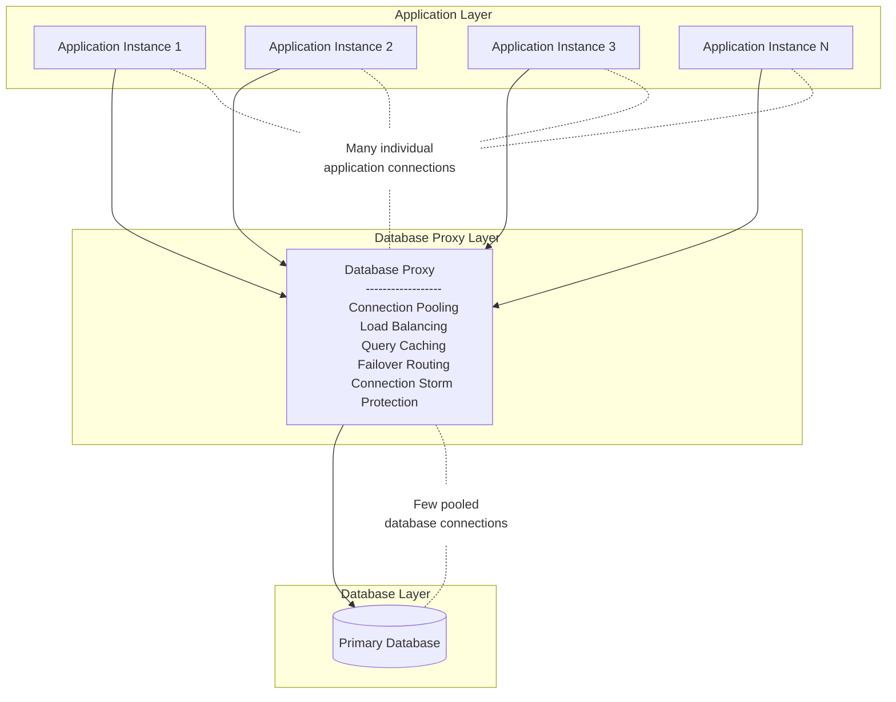
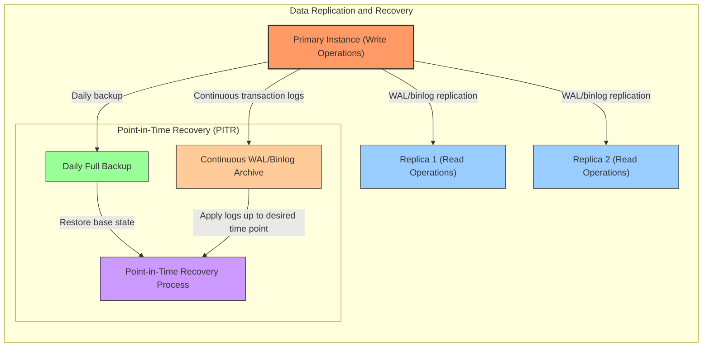

# Edric Coaching Module 4 - Week 5

# Feedback from Edric for presentation

- **Test your pipeline**: You should treat your CI/CD pipeline as a piece of code and testing is important
  - Example: Using real tokens in your code scanning test to validate that your authentication implementation works correctly in production-like conditions.

- **Frontend security**: Do not put secret in your frontend, it is not safe
  - Frontend code is accessible to users, making any secrets stored there vulnerable to theft and misuse.

- **Environment variable handling**: The population of the environment variable could be simplified. You shouldn't need to inject into the .env file, you just have to inject the data into the runtime environment variable

- **Container optimization**: Multi stage build, you might need a lot of extra dependencies during your build stage but you can use a leaner image when serving them
  - Including unneeded tools in your production container increases image size and potential attack surface.

- **Branch naming convention**: Don't use develop as the default branch, use main
  - Using "main" aligns with modern Git conventions and creates a more intuitive workflow.

- **Deployment versioning**: Using the latest is not the best approach, ideally you should generate the release version using semantic versioning.
  - Specifying exact versions ensures deployment consistency and enables controlled rollbacks when needed.

- **Developer experience**: Think about the user experience of a developer when you are designing the CI/CD pipeline
  - User-friendly CI/CD pipelines increase adoption, reduce developer's frustration, and improve overall productivity.

- **Service co-location**: Your server and database should be close to each other, ideally in the same region
  - Keeping related services in the same region minimizes latency, improves performance, and can reduce costs.

- **Choose the right tool**: Tools like AWS are very powerful, you can provide permission on a very fine grained level, but it is also more complicated at the same time, so choose your tool wisely based on your team expertise and needs.

- **Setup budget alert**: Budget alert is important. Set it up before you pay a giant bill!

# Deployment Best Practices
## 1. Frontend Architecture

### 1.1 Content Delivery Networks (CDNs)

**What are CDNs?**
Content Delivery Networks are distributed server networks that deliver web content to users based on their geographic location, the origin of the webpage, and the content delivery server.

**Best Practices:**
- **Implement Global CDNs**: Distribute static assets (JavaScript, CSS, images) across geographically dispersed servers to reduce latency and improve load times
- **CDN Selection Criteria**:
  - Geographic coverage matching your user base
  - Performance metrics (TTFB, throughput)
  - Security features (WAF, DDoS protection)
  - Cost structure aligned with your traffic patterns

**Implementation Options:**
- Cloudflare, Fastly, AWS CloudFront, Akamai, Google Cloud CDN, Azure CDN

### 1.2 Static Asset Optimization

**Best Practices:**
- **Minification**: Remove unnecessary characters (whitespace, comments) from HTML, CSS, and JavaScript
- **Uglify**: Minify and obfuscate JavaScript code to reduce file size
- **Bundling**: Combine multiple files to reduce HTTP requests while maintaining logical separation
- **Code Splitting**: Break large bundles into smaller chunks loaded on demand

**Tools:**
- Webpack, Rollup, Parcel, esbuild for bundling and optimization
- Google Lighthouse for performance auditing

## 2. Backend Architecture

### 2.1 Containerization

**Docker Container Best Practices:**
- Use multi-stage builds to reduce image size and attack surface
- Implement least privilege principle (non-root users, minimal permissions)
- Scan images for vulnerabilities before deployment
- Store container images in secure, private registries
- Implement proper tagging strategies (avoid using "latest" tag)

**Container Orchestration:**
- Kubernetes for complex, multi-service deployments
- Amazon ECS/EKS, Google GKE, or Azure AKS for managed orchestration
- Implement resource limits and requests to prevent resource starvation

**Container Security:**
- Regular security scanning and patching
- Network policies to control container communication

### 2.2 Scaling and Resource Management

**Auto-scaling:**
- Handle variable workloads efficiently
- Maintain performance during traffic spikes
- Optimize costs during low-demand periods
- Improve application resilience

**Rate Limiting and Throttling:**
- Protect backend resources from excessive use
- Per-user, per-client, or per-endpoint limits
- Implement gradual throttling vs. hard cutoffs
- Clear communication of limits in responses (headers)

### 2.3 Configuration and Deployment Strategies

**Configuration Services:**
- Centralized configuration management
- Runtime configuration updates
- Configuration versioning and rollback
- Options: AWS AppConfig, Spring Cloud Config, Consul
- Feature flags for runtime behavior changes

**Canary Releases:**
- Gradually shift traffic from old to new version
- Monitor metrics and errors during transition
- Automated rollback if issues detected
- Reduces risk compared to all-at-once deployment

**Feature Flags:**
- Decouple deployment from feature release
- Control feature visibility at runtime
- A/B testing capabilities
- Gradual feature rollout to users
- Emergency kill switch for problematic features

## 3. Database Architecture

### 3.1 Database Proxies

**Implementation Benefits:**
- Connection pooling to reduce database connection overhead
- Load balancing across database replicas
- Automated failover routing
- Query caching for repeated queries
- Protection from connection storms

**Popular Solutions:**
- AWS RDS Proxy, Azure SQL Database Proxy

### 3.2 Data Redundancy and Recovery

**Replication Strategies:**
- Primary-Replica (Leader-Follower) model:
  - One primary (write) instance with multiple read replicas
  - Replicas typically lag slightly behind primary
  - Configure automatic promotion of replicas if primary fails
  - Consider cross-region replicas for disaster recovery

**Backup and Recovery:**
- Point-in-Time Recovery (PITR):
  - Regular full backups (daily recommended)
  - Continuous transaction log backup (WAL, binary logs)
  - Secure, separate storage for backups
  - Retention policy aligned with compliance requirements

**Deployment Best Practices:**
- Automate backup processes
- Verify backups with regular restoration tests
- Store backups in different geographical regions
- Encrypt backups at rest and in transit
